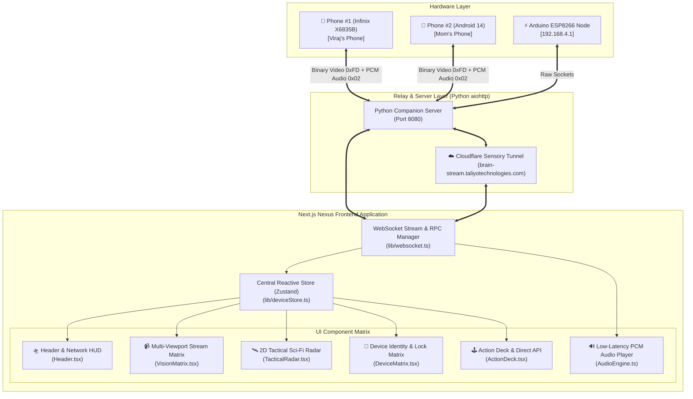

# 🌐 ULTRON NEXUS — Next.js Architecture Blueprint
### Sovereign AI Perception, Neural Streaming & Multi-Device Command Deck
**VirajVerse Universe #1 Brain** • *Next.js 15+ Enterprise Reactive Architecture*

---

```
  ███╗   ██╗███████╗██╗   ██╗██╗   ██╗███████╗
  ████╗  ██║██╔════╝╚██╗ ██╔╝██║   ██║██╔════╝
  ██╔██╗ ██║█████╗   ╚████╔╝ ██║   ██║███████╗
  ██║╚██╗██║██╔══╝    ╚██╔╝  ██║   ██║╚════██║
  ██║ ╚████║███████╗   ██║   ╚██████╔╝███████║
  ╚═╝  ╚═══╝╚══════╝   ╚═╝    ╚═════╝ ╚══════╝
  SOVEREIGN MULTI-DEVICE PERCEPTION & COMMAND SUITE
```

---

## 📑 Table of Contents
1. [Executive Summary & Core Objectives](#1-executive-summary--core-objectives)
2. [Monolith (`index.html`) vs Next.js Modular Architecture](#2-monolith-vs-nextjs-modular-architecture)
3. [System Architecture & Data Flow Diagram](#3-system-architecture--data-flow-diagram)
4. [Target Directory & File Hierarchy](#4-target-directory--file-hierarchy)
5. [Reactive State Management (Zustand / Context)](#5-reactive-state-management)
6. [Core Component Breakdown](#6-core-component-breakdown)
7. [WebSocket & Real-Time Binary Stream Protocol](#7-websocket--real-time-binary-stream-protocol)
8. [2D Sci-Fi Tactical Radar & Find My Device Engine](#8-2d-sci-fi-tactical-radar--find-my-device-engine)
9. [Remote Identity & Profile Lock System](#9-remote-identity--profile-lock-system)
10. [Implementation & Migration Roadmap](#10-implementation--migration-roadmap)

---

## 1. Executive Summary & Core Objectives

**Ultron Nexus** is the next-generation, high-performance web cockpit for the **VirajVerse Brain & Companion Ecosystem**. It serves as the primary visual, auditory, and tactile control bridge between **Ultron AGI** and multiple real-world hardware endpoints (Android Phones, Tablets, ESP8266 IoT nodes, and local robots).

### 🎯 Primary Objectives:
- **Zero-Latency Multi-Device Perception:** Stream low-latency JPEG/H.264 video frames and raw 16kHz PCM audio simultaneously from multiple mobile nodes.
- **Failproof State Management:** Eliminate DOM race conditions and variable collisions by utilizing reactive, immutable state stores (Zustand).
- **Sovereign Cloud & Local Hybrid Routing:** Seamless instant failover between High-Speed Local LAN (`http://10.196.124.216:8080`) and Encrypted Cloudflare Tunnel (`wss://brain-stream.taliyotechnologies.com/ws`).
- **Cyberpunk / Sci-Fi Tactical Aesthetics:** High-end glassmorphism, animated 2D radar sweepers, live Google satellite overlays, and reactive telemetry HUDs.

---

## 2. Monolith (`index.html`) vs Next.js Modular Architecture

| Architectural Dimension | Old Monolith (`index.html`) | **Next.js 15+ Nexus Architecture** |
| :--- | :--- | :--- |
| **Code Organization** | 5,000+ lines in a single unstructured file | Cleanly isolated reusable React components |
| **State Management** | Fragile global JS variables (`window.connectedDevices`) | Immutable, type-safe reactive store (Zustand) |
| **DOM Rendering** | Manual string concatenation (`innerHTML += ...`) | Virtual DOM with optimized incremental re-renders |
| **Device Dropdown** | Re-rendered entire `<select>`, resetting user selection | Stable reactive dropdown with zero UI flashing |
| **Canvas & Stream Engine** | Single-threaded main thread canvas drawing | Multi-canvas hardware accelerated viewports |
| **Styling & Theme** | 2,000 lines of mixed inline CSS | Modular CSS & Design Tokens with zero class collisions |
| **Extensibility** | High risk: 1 typo breaks all 50 features | Modular: Adding a new tab or feature has zero side-effects |

---

## 3. System Architecture & Data Flow Diagram



---

## 4. Target Directory & File Hierarchy

```
companion_studio/nexus/
├── 📄 package.json                  # Next.js, React, Lucide Icons, Zustand, Canvas-Confetti
├── 📄 tsconfig.json                 # Strict TypeScript configuration
├── 📄 next.config.mjs               # Next.js optimization & standalone config
├── 📄 BLUEPRINT.md                  # Complete System Architecture Blueprint
├── 📁 public/                       # Static audio assets, sound effects, icons
│   ├── favicon.ico
│   └── sounds/                      # Sci-fi click, lock alert, radar ping SFX
├── 📁 src/
│   ├── 📁 app/                      # Next.js App Router
│   │   ├── layout.tsx               # Root Layout with Glassmorphism Background & Fonts
│   │   ├── page.tsx                 # Main Nexus Studio Cockpit Dashboard
│   │   └── globals.css              # Cyberpunk Design System & Glassmorphism Tokens
│   │
│   ├── 📁 components/               # Modular UI Components
│   │   ├── 📁 header/
│   │   │   ├── Header.tsx           # Logo, Brand, Master Audio, Cloud Toggle
│   │   │   ├── DeviceSelector.tsx   # Safe Dynamic Device Target Selector Dropdown
│   │   │   └── ConnectionBadge.tsx  # Live Status Indicator (Local / Cloud / Disconnected)
│   │   │
│   │   ├── 📁 vision/
│   │   │   ├── VisionMatrix.tsx     # Multi-Phone Viewport Wrapper (Single & Dual View)
│   │   │   ├── PhoneViewport.tsx    # Individual Phone Frame with Notch, Canvas & HUD
│   │   │   ├── VisionDeck.tsx       # 5-Way Mode Switcher (View, Touch, Back Cam, Front Cam, Stop)
│   │   │   └── TouchOverlay.tsx     # Normalized Remote Touch & Gesture Dispatcher
│   │   │
│   │   ├── 📁 sensory/
│   │   │   ├── TacticalRadar.tsx    # 2D Animated Sci-Fi Radar Canvas
│   │   │   ├── LiveMapPortal.tsx    # Google Satellite Dark Iframe Map Embed
│   │   │   └── FindMyDeviceDeck.tsx # Quick Security Deck (Ring Phone, Remote Lock, Refresh)
│   │   │
│   │   ├── 📁 devices/
│   │   │   ├── DeviceMatrix.tsx     # Discovered Devices Grid Cards
│   │   │   ├── DeviceCard.tsx       # Real-time Telemetry, Owner & Relation Badges
│   │   │   └── RemoteProfileLock.tsx# Studio Remote Profile & Lock Configurator
│   │   │
│   │   ├── 📁 controls/
│   │   │   ├── ActionDeck.tsx       # 1-Click Hardware Buttons (Power, Vol, Flash, Brightness)
│   │   │   ├── AppLauncher.tsx      # Installed Apps Scanner & Direct Package Launcher
│   │   │   ├── DirectDialer.tsx     # Contacts Search & Native GSM Direct Call Trigger
│   │   │   └── SmsMessenger.tsx     # SMS Threads Viewer & Real-Time Dispatcher
│   │   │
│   │   └── 📁 telemetry/
│   │       ├── TelemetryGrid.tsx    # Battery, Temperature, Storage, RAM, WiFi Matrix
│   │       └── ThermalAlert.tsx     # Dynamic Thermal Governor Status Banner
│   │
│   ├── 📁 lib/                      # Core Engines & Utilities
│   │   ├── websocket.ts             # Robust Multi-Endpoint WebSocket Client
│   │   ├── deviceStore.ts           # Zustand Central State Management
│   │   ├── audioEngine.ts           # WebAudio 16kHz PCM Player & Buffer Scheduler
│   │   ├── touchMapper.ts           # Physical-to-Virtual Coordinate Normalizer
│   │   └── types.ts                 # TypeScript Interfaces for all Packets & Devices
│   │
│   └── 📁 styles/
│       └── glassmorphism.css        # Rich Dark Mode Cyberpunk Glass & Neon Styles
```

---

## 5. Reactive State Management (Zustand)

The entire application state is managed by a centralized, lightweight **Zustand store** (`lib/deviceStore.ts`), ensuring instantaneous reactivity across all components without prop-drilling or DOM race conditions.

```typescript
export interface DeviceProfile {
  id: string;
  name: string;
  model: string;
  label: string;
  index: number;
  owner: string;
  relation: string;
  role: string;
  isOnline: boolean;
  battery?: number;
  temperature?: number;
  storageGb?: string;
  wifiSsid?: string;
  lat?: number;
  lon?: number;
}

export interface NexusState {
  // Connection State
  isWsConnected: boolean;
  activeEndpoint: 'LOCAL' | 'CLOUD';
  wsLatencyMs: number;

  // Multi-Device Registry
  devices: Record<number, DeviceProfile>;
  selectedDeviceIndex: number | null; // null = Broadcast (ALL)
  selectedDeviceId: string;

  // Perception & Vision Mode
  activeVisionMode: 'SCREEN_VIEW' | 'SCREEN_TOUCH' | 'CAM_BACK' | 'CAM_FRONT' | 'STOP';
  isAudioStreaming: boolean;
  masterVolume: number;
  manualRotationDeg: number;

  // Actions
  registerDevice: (index: number, payload: any) => void;
  unregisterDevice: (index: number) => void;
  selectTargetDevice: (index: number | null) => void;
  setVisionMode: (mode: NexusState['activeVisionMode']) => void;
  updateTelemetry: (index: number, data: any) => void;
}
```

---

## 6. Core Component Breakdown

### 6.1 `DeviceSelector.tsx` (Flawless Target Switcher)
- Replaces the old crashing HTML dropdown.
- Fully synchronized with `deviceStore`.
- Formats labels cleanly: `📱 #1 Viraj (Self) - Infinix X6835B` or `📱 #2 Mom (Mother) - Infinix X6835B`.
- Auto-preserves user selection across phone reconnections.

### 6.2 `PhoneViewport.tsx` (Dynamic Canvas Viewport)
- Renders hardware-accelerated `<canvas>` for video frames.
- Automatically adjusts aspect ratio based on stream payload (Smartphone Portrait vs Tablet Landscape).
- Shows live FPS gauge, battery temp badge, and notch animation.

### 6.3 `TacticalRadar.tsx` (2D Animated Sci-Fi Canvas)
- Standby mode renders a 60 FPS 2D canvas radar with neon concentric rings, rotating laser sweep cone, and grid crosshairs.
- Transitions seamlessly into live embedded Google Satellite terrain upon GPS coordinate acquisition.

### 6.4 `RemoteProfileLock.tsx` (Owner Profile & Lock Manager)
- Allows Viraj to define Owner Name, Relationship (`Mom`, `Dad`, `Sister`, `Friend`, etc.), and Note for Viraj.
- Dispatches `UPDATE_DEVICE_PROFILE` with `{ lock_editing: true }` over WebSocket to permanently lock profile editing on the phone.

---

## 7. WebSocket & Real-Time Binary Stream Protocol

### Inbound Frame Parsing Specification:
```
┌─────────────────────────────────────────────────────────────┐
│ 2-Byte Prefix Header                                        │
├──────────────────────────────┬──────────────────────────────┤
│ Byte 0                       │ Byte 1                       │
│ 0xFD = Video JPEG Frame      │ Target Device Index (0, 1...) │
│ 0x02 = Audio 16kHz PCM Stream│ Target Device Index (0, 1...) │
└──────────────────────────────┴──────────────────────────────┘
│ Remaining Payload: Binary Frame Data (JPEG / Raw Audio PCM) │
└─────────────────────────────────────────────────────────────┘
```

### Outbound RPC Command Dispatch (`sendDirectApi`):
```json
{
  "type": "DIRECT_API",
  "action": "UPDATE_DEVICE_PROFILE",
  "target_device_index": 1,
  "owner_name": "Mom",
  "relation_viraj": "Mom / Mummy",
  "feedback": "Mom's daily phone",
  "lock_editing": true
}
```

---

## 8. Implementation & Migration Roadmap

```
  Phase 1: Foundation
  ├── Initialize Next.js 15 app in companion_studio/nexus/
  ├── Configure TypeScript, Tailwind & Glassmorphism Design System
  └── Implement Zustand Store & WebSocket Client Library

  Phase 2: Core Components
  ├── Build Header, Connection Status & Safe Device Selector Dropdown
  ├── Implement Multi-Device Viewport (PhoneViewport & Canvas Engine)
  └── Implement 5-Way Vision Deck & Remote Touch Normalizer

  Phase 3: Sensory & Sci-Fi Features
  ├── Integrate 2D Animated Tactical Radar Canvas
  ├── Build Google Satellite Find My Device Portal
  └── Connect WebAudio 16kHz PCM Decoder & Volume Slider

  Phase 4: Device Identity & Sovereign Actions
  ├── Implement Remote Profile & Studio Lock Manager
  ├── Implement 1-Click Action Deck, Dialer, and SMS Messenger
  └── End-to-End Multi-Phone Verification & Live Deployment
```

---

*Architected and Engineered for VirajVerse Universe #1 Brain • Ultron Sovereign Perception Engine*
